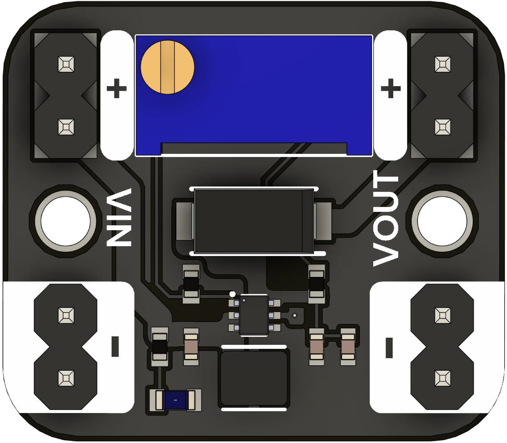

# Boost Converter Module

## Introduction
The Boost Converter Module is a compact, adjustable **DC–DC** **step-up** (boost) regulator designed to increase a `lower input` voltage to a `higher output` voltage. It uses a high-efficiency switching regulator chip and a multi-turn potentiometer for fine output voltage adjustment. This makes it ideal for battery-powered projects and applications where you need to boost voltage from sources like LiPo cells, USB power banks, or solar panels.

<div align="center">
    <a href="#"><br/>UNIT Boost converter</a>
<br/>

</div>

## Applications

|Aplications                      |Example                                                      |
|---------------------------------|-------------------------------------------------------------|
|**Battery-powered systems**      | Boost 3.7 V LiPo to 5 V for microcontrollers or peripherals | 
|**LED drivers**                  | Power high-voltage LED strings from low-voltage supplies    |  
| **Portable electronics**        | Create regulated higher voltages in compact form factors    | 
| **Sensor modules**              | Supply sensors requiring >5 V from 3.3 V systems            |  
| **DIY projects & prototyping**  | Easy integration for stepping up voltage rails              |  

## Features

|Feature                        |Description                                             |
|-------------------------------|--------------------------------------------------------|
| **Wide input range**          | --                                                     | 
| **Adjustable output**         | Up to -- V (set via on-board multi-turn potentiometer) |  
| **High efficiency**           | Up to -- % efficiency under optimal conditions         |  
| **High switching frequency**  | ~-- MHz for small component sizes                      |  
| **Compact PCB**               | Breadboard-friendly -- × -- mm footprint               |    


## Quick Start


1. **Wire up**  
   - Connect your lower-voltage source to **VIN +** and **VIN –**.  
   - Connect your load to **VOUT +** and **VOUT –** (common ground).  
2. **Adjust output**  
   - Use a small screwdriver to turn the potentiometer clockwise to raise voltage, counter-clockwise to lower.  
   - Monitor the output with a multimeter for precise setting.  
3. **Test under load**  
   - Apply a typical load and verify the voltage remains stable.

---

> **Tip:** Always start with the potentiometer turned fully counter-clockwise (lowest voltage) before applying power. Then slowly dial up to your target voltage while monitoring with a meter.

## Documentation and Setup

### Overview
This repository contains firmware and documentation for integrating the BMM150 magnetometer into your project. The examples provided demonstrate sensor configuration, data acquisition, and interfacing via both I²C and SPI.

### Installation
1. Clone the repository:
   ```
   git clone git@github.com:UNIT-Electronics-MX/unit_boost_converter.git
   ```
2. Navigate to the project directory:
   ```
   cd ./unit_boost_converter
   ```
3. Follow the platform-specific setup instructions detailed in the project documentation.

### Usage
Include the sensor initialization and configuration routines in your main project file. Sample code snippets and detailed explanations can be found in the documentation folder of the repository.


## Support
For any issues or further assistance, please open an issue on the GitHub repository or contact our support team.


## License
This project is licensed under the MIT License - see the [LICENSE](LICENSE) file for details.

## Resources