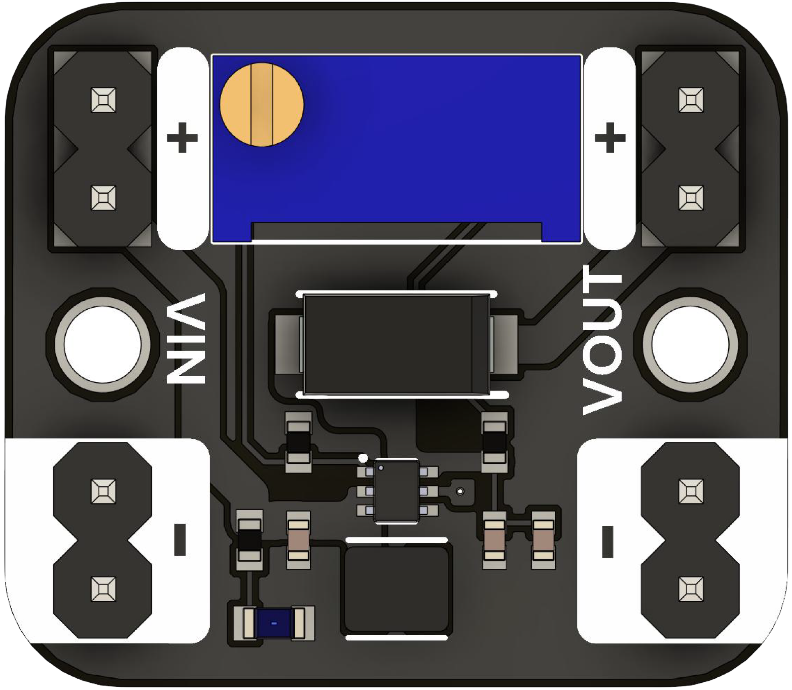

# Boost Converter Module

## Introduction

The Boost Converter Module is a compact, adjustable **DC–DC step-up (boost)** regulator designed to increase a lower input voltage to a higher output voltage. It is powered by the **TPS61023** high-efficiency switching regulator from **Texas Instruments**, enabling reliable operation even from low-voltage sources such as LiPo batteries or solar panels.  
A multi-turn potentiometer is included for precise output voltage adjustment, making the module ideal for battery-powered applications and compact embedded systems.

This makes it ideal for powering circuits from LiPo cells, USB power banks, solar panels, and other low-voltage sources in embedded projects and prototyping.

<div align="center">
    <a href="#"><br/>UNIT Boost Converter</a>
</div>

---

## Applications

| **Applications**               | **Example**                                              |
|--------------------------------|-----------------------------------------------------------|
| **Battery-powered systems**    | Boost 3.7 V LiPo to 5 V for microcontrollers or sensors   |
| **LED drivers**                | Drive high-voltage LED strings from 3 V or 3.7 V input    |
| **Portable electronics**       | Step-up for small regulated power in mobile designs       |
| **Sensor modules**             | Power 5 V+ sensors from 3.3 V systems                     |
| **DIY projects & prototyping** | Simple integration in breadboard or PCB-based designs     |

---

## Features

| **Feature**                   | **Description**                                                                 |
|-------------------------------|---------------------------------------------------------------------------------|
| **Regulator IC**              | Texas Instruments TPS61023 – high-efficiency boost converter                   |
| **Input Voltage Range**       | 0.5 V to 5.5 V                                                                 |
| **Start-up Voltage**          | Operates from input as low as 0.7 V                                           |
| **Adjustable Output**         | Up to 5.5 V (via onboard multi-turn potentiometer)                            |
| **Output Current**            | Up to 1 A (depending on input/output conditions)                              |
| **Efficiency**                | Up to 96 % under optimal conditions                                            |
| **Switching Frequency**       | ~2 MHz for reduced external component size                                    |
| **Protections**               | Overcurrent (OCP), thermal shutdown, undervoltage lockout (UVLO)              |
| **Form Factor**               | Breadboard-friendly 22 mm × 17 mm PCB                                         |
| **Applications**             | Ideal for LiPo boosts, USB power banks, solar panels, sensors, LEDs, prototyping |
| **Datasheet**                | [TPS61023 – Texas Instruments](https://www.ti.com/product/TPS61023)           |


---

## Quick Start

1. **Wire up**  
   - Connect your lower-voltage source to **VIN +** and **VIN –**.  
   - Connect your load to **VOUT +** and **VOUT –** (common ground).  
2. **Adjust output**  
   - Use a small screwdriver to turn the potentiometer clockwise to raise voltage, counter-clockwise to lower.  
   - Monitor the output with a multimeter for precise setting.  
3. **Test under load**  
   - Apply a typical load and verify the voltage remains stable.

---

> **Tip:** Always start with the potentiometer turned fully counter-clockwise (lowest voltage) before applying power. Then slowly dial up to your target voltage while monitoring with a meter.

---

## Documentation and Setup

### Overview
This repository contains firmware and documentation for integrating the Boost Converter into your project.

### Installation
1. Clone the repository:
   ```
   git clone git@github.com:UNIT-Electronics-MX/unit_boost_converter.git
   ```
2. Navigate to the project directory:
   ```
   cd ./unit_boost_converter
   ```
3. Follow the platform-specific setup instructions detailed in the project documentation.

## Support
For any issues or further assistance, please open an issue on the GitHub repository or contact our support team.


## License
This project is licensed under the MIT License - see the [LICENSE](LICENSE) file for details.

## Resources
