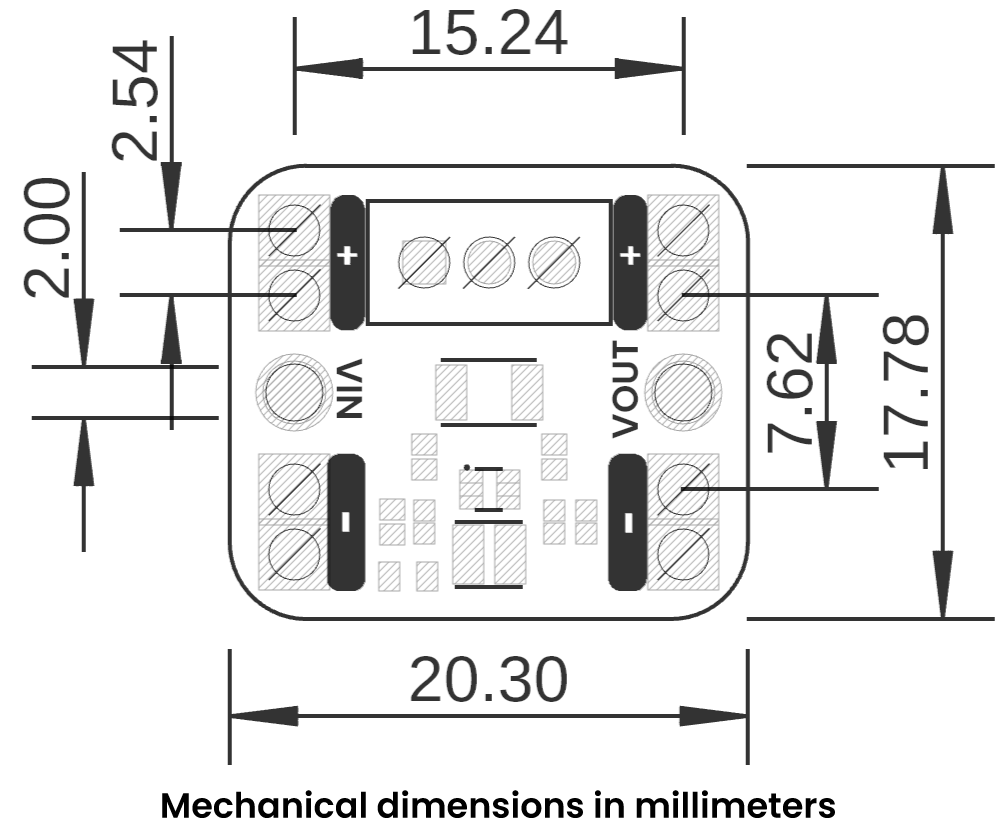

# **Schematic**

    <a href="resources/unit_sch_v_0_1_0_ue0087_tps61023_boost.pdf">
          
        Schematics (PDF)
    </a>

---

# **Pinout**

    <a href="#">
          
        Pinout Diagram
    </a>

---

## **Pin Descriptions**

| **Pin Group**  | **Label**     | **Function**                                                               |
|----------------|---------------|----------------------------------------------------------------------------|
| **Input**      | VIN           | Positive input voltage. Connect your supply’s positive terminal here.     |
| **Input**      | GND Input     | Ground reference for input. Connect the supply’s negative terminal here.  |
| **Output**     | VOUT          | Boosted positive output. Provides regulated higher voltage.               |
| **Output**     | GND Output    | Output ground. Connect to your load's ground or system ground.            |
| **Adjustment** | POT           | Multi-turn potentiometer to set the output voltage precisely.             |

---

# **Board Topology**

      

| **Reference** | **Component**                 | **Description**                                     |
|---------------|-------------------------------|-----------------------------------------------------|
| **U1**        | TPS61023                      | Main boost converter IC by Texas Instruments        |
| **RV1**       | Potentiometer (multi-turn)    | Allows precise adjustment of the output voltage     |
| **L1**        | Power Indicator LED           | Lights up when input voltage is present             |
| **F1**        | Resettable Fuse (1 A)         | Protects the circuit from overcurrent conditions    |
| **JP1**       | VIN+ Pad                      | Positive terminal for power supply input            |
| **JP2**       | VIN– Pad                      | Ground terminal for power supply input              |
| **JP3**       | VOUT+ Pad                     | Positive terminal for boosted output                |
| **JP4**       | VOUT– Pad                     | Ground terminal for boosted output                  |

---

# **Dimensions**

    <a href="#">
         
        Mechanical Dimensions
    </a>

